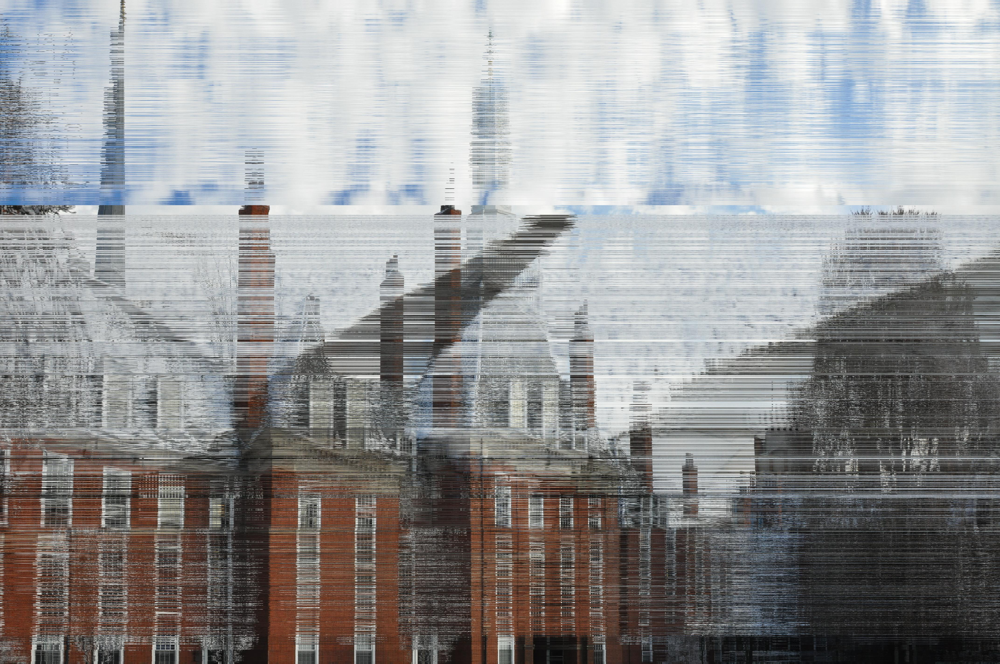
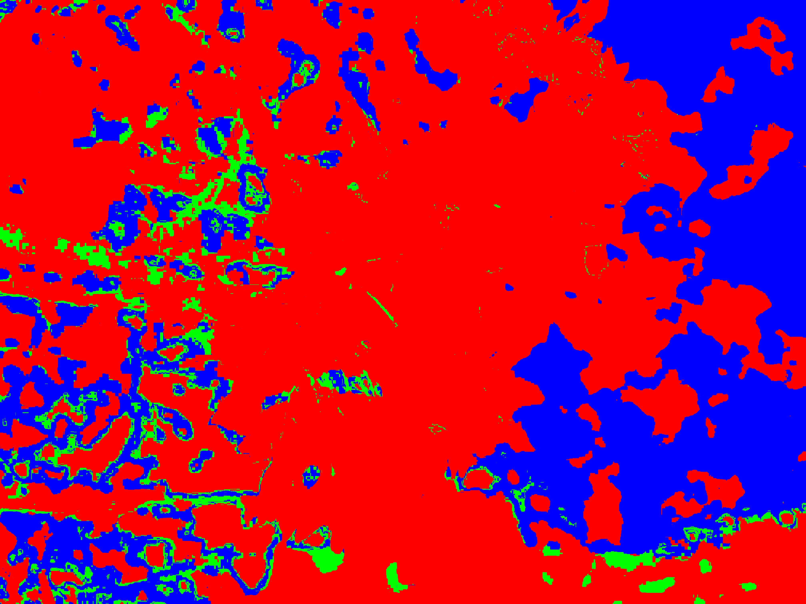
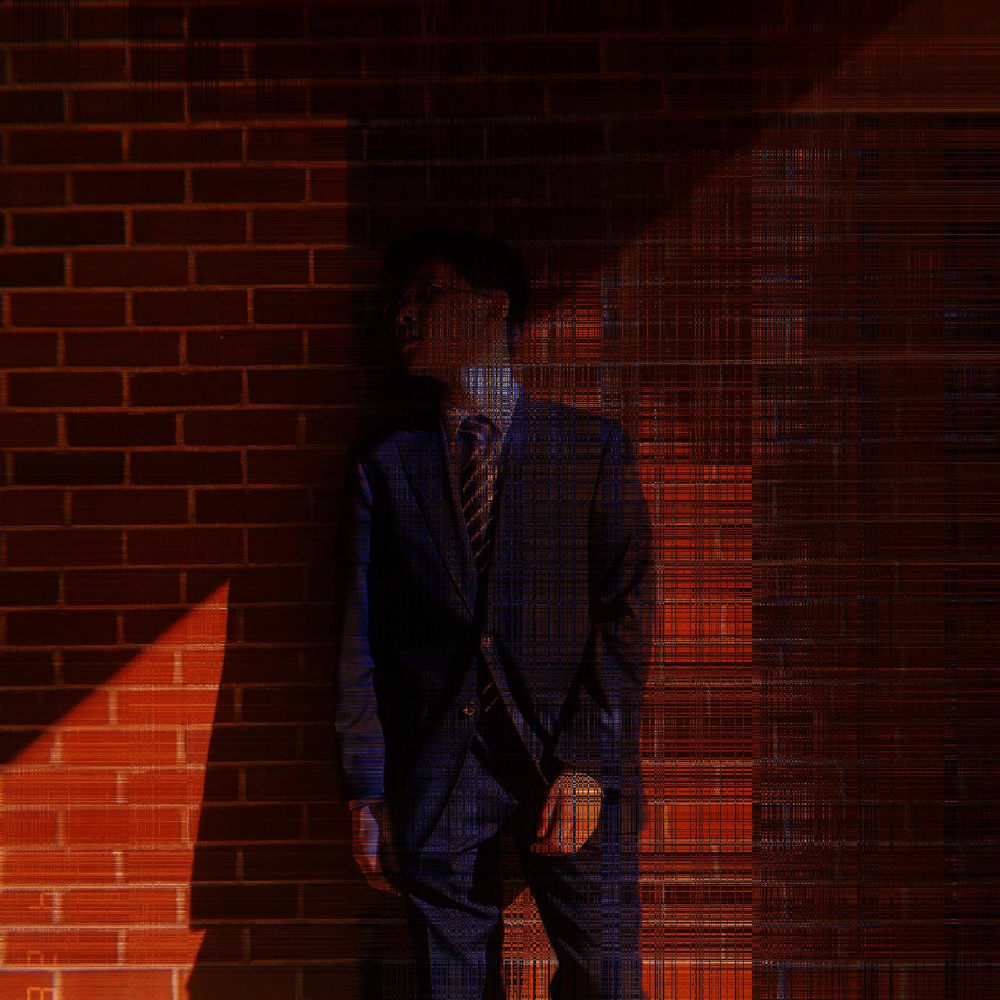
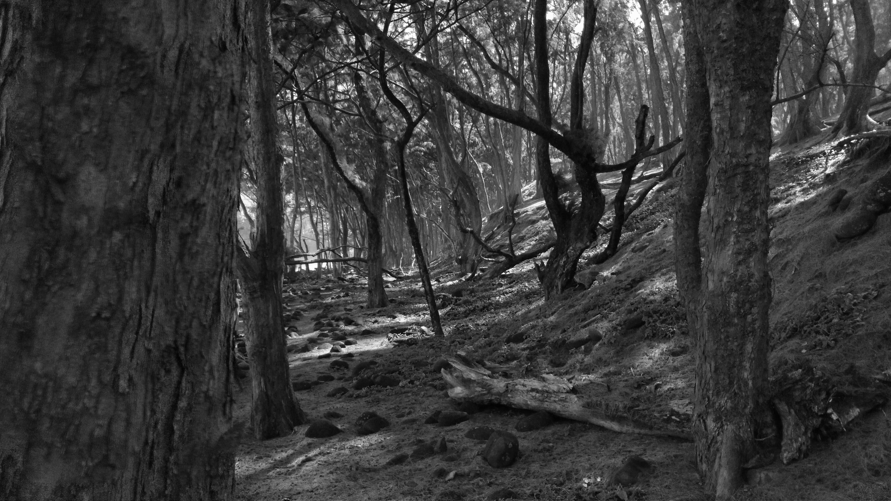

# Image-Fun

Just playing with images and Python

## Interesting Findings:

For the mergesort, it is really cool to have images with well defined vertical lines like in the Silliman photo:

Also it was cool to see in many of the maxRGB sorts that many of the color areas were boxes of various sizes which might show some byproducts of compression?

## Other cool photos:

(also accidentally had my program name some photos with "madRGB" instead of "maxRBG" but I'd rather not manually change everything- "madRGB" fits anyways)
